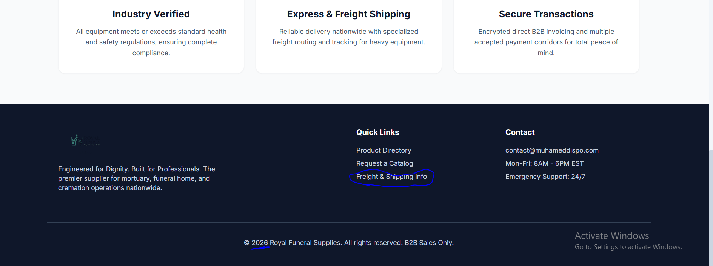
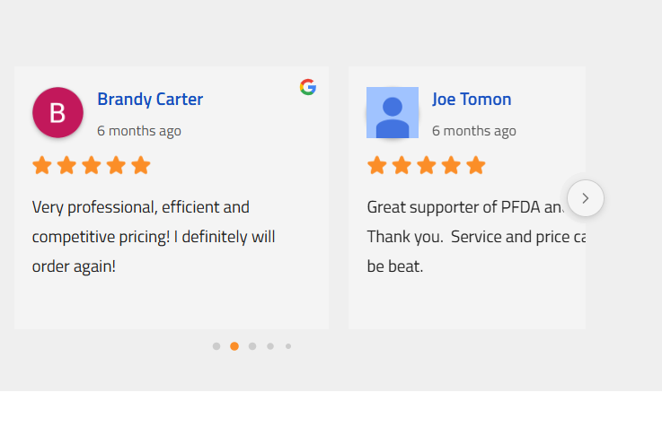

A) please in the nav bar the about us please when clicked it should open to its own page and this text should be written in it [Royal Funeral Supplies has remained family-owned and operated since David Nrimah launched the business in 2018. From the very beginning we have been driven to deliver an unparalleled level of service within the industry.

In 2023, Maxwell Funer purchased the business, sharing the same vision as started by Mr. Nrimah. Maxwell brings hands-on experience of personally using these products through his work at the coroner’s office and his own removal service. When you have specific questions, you won’t get the typical salesperson runaround from us. Maxwell has been in your shoes and will walk you through the process of finding the right products.

We offer a wide array of products from industry brand leaders, including operating tables, mortuary cots, body bags, flexible stretchers, church trucks, folding dressing tables, marble urn vaults, urn and jewelry bags, flag cases and much more.

What We Do
At Royal Funeral Supplies we understand it takes more than product access and awareness to be a good supplier – we have hands-on experience for each and every item we recommend.

We provide unparalleled service and our focus is always on making your best interests our top priority. Relationships matter – and we believe in treating you right, providing straightforward answers to your questions and meeting your unique needs.

Royal Funeral Supplies takes pride in making every client a 100% satisfied client. If for some reason we miss an expectation, we’ll make it right. ]
B) please in the nav bar for the contact us, when the cleint clicks it a drop down menu should show and our email should be displayed in which if clicked takes them to email app to message us.
please  based on this image where it says frieght and shipping change it to Return policy and when clicked it should eneter it's own page and should state this [ If you are not satisfied with a product that you purchased from Royal Funeral Supplies, Inc., please notify Royal Funeral Supplies, Inc. within 7 days of receipt of product so a return authorization approval from the manufacturer can be obtained. Once the return authorization is obtained and provided to you, you may return the product for a refund of the purchase price, minus the original shipping charge and any applicable manufacturer restocking charge. The product must be returned in new, unused and/or unopened condition in original boxes and with all paperwork, parts, and accessories to ensure credit. After the product has been received and inspected by the manufacturer, Royal Funeral Supplies, Inc. will reimburse you for the purchase price less the original shipping charge and any applicable manufacturer restocking charge. The cost of returning a product is the responsibility of the customer. If you’d like to know if the manufacturer(s) of the product(s) you are interested in purchasing requires a restocking fee for returned merchandise, please call or email Royal Funeral Supplies, Inc. before purchasing. Royal Funeral Supplies, Inc. does not accept any returns or exchanges on custom, special-order items. Royal Funeral Supplies, Inc. does not issue store credit.] 
C) and that 2026 change it to 2024
D) please i want to you to create my my own reviews like 20 ( demo but it should loove very real and proffesioanl even morethan this one ) and please it should do an automatic scrolling from left to right with a very good animation please.
And also when a cleintadds to cart and he/she wants to submit before doing so he/she must fill in their information ( and choose what payment method they want ( please the payment methods should all have their logo too) when they choose they payment method and submit the cart a proffesional invoice should be sent to both the cleint and to me; this is my resend api key: re_PRvbKt7K_AZviJrNf1K7hMAg4o5dePD7r) please when the invoice goes to the cleints email it should also state that based on the payment method he/she chooce the account details will be sent vai email.. and also please let me receive the invoice too and his order to appear in the admin dahboard please..
Also please i notice the live chat that i told you to connect i can not see it, like the widget is not pooping up please check the issue and fix it please 